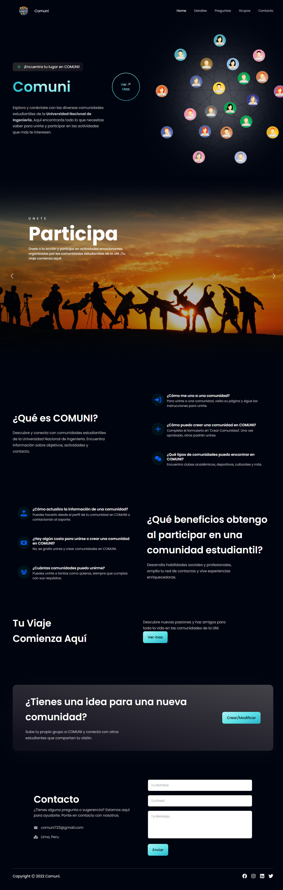
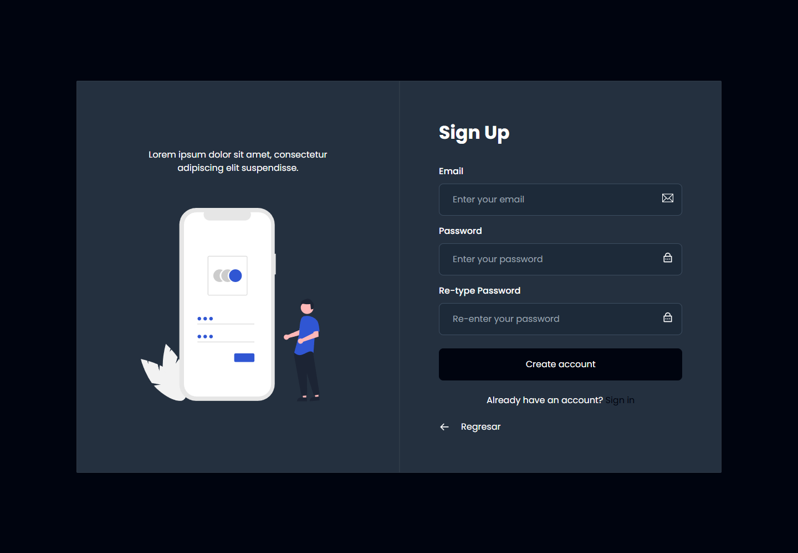
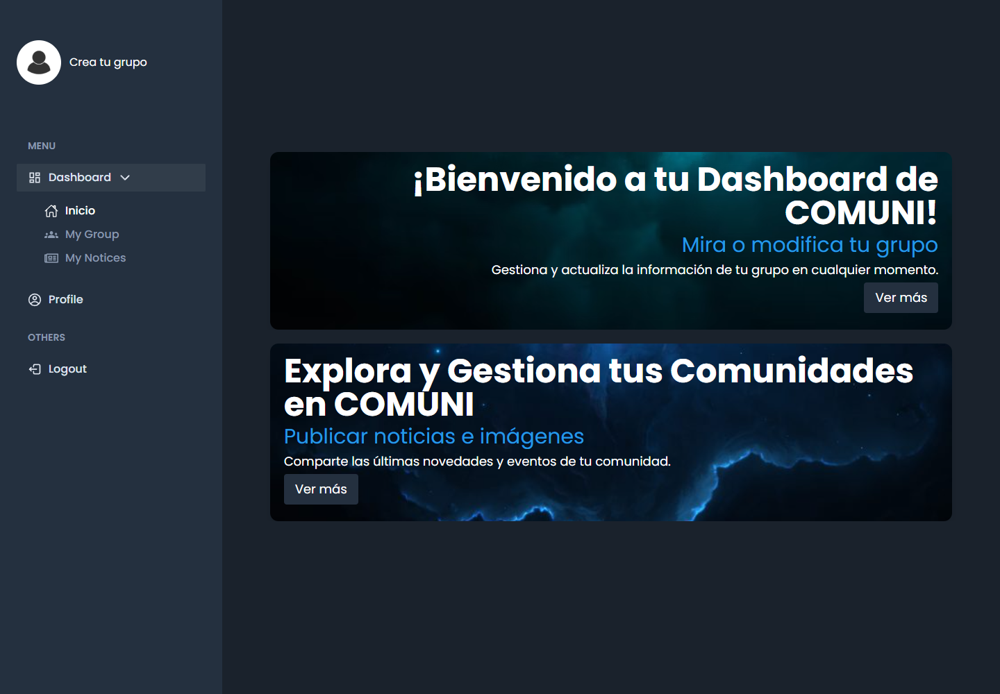
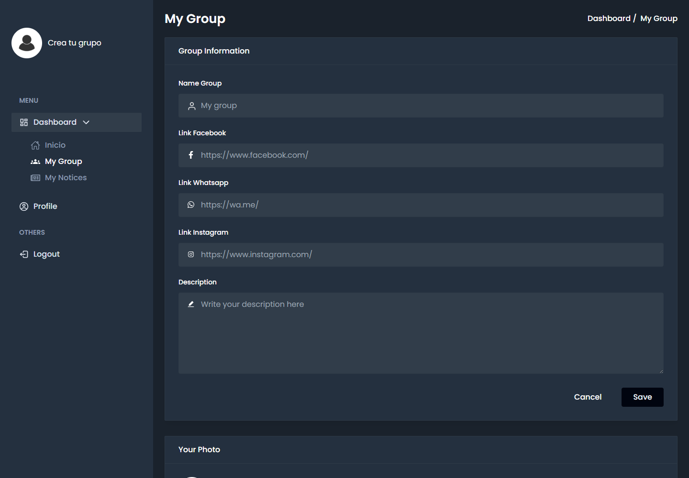
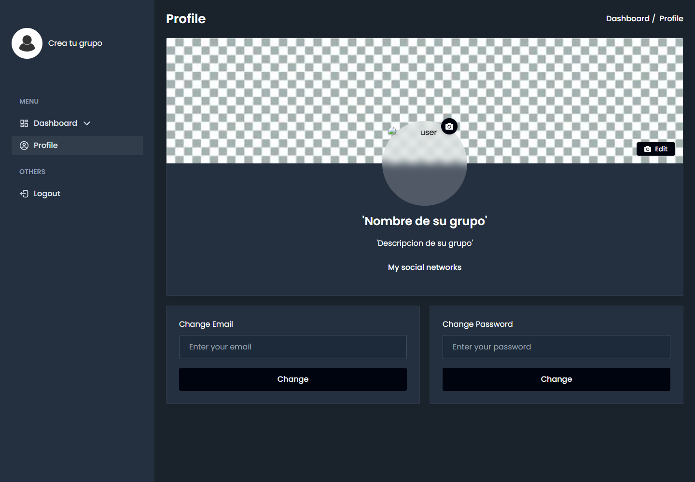
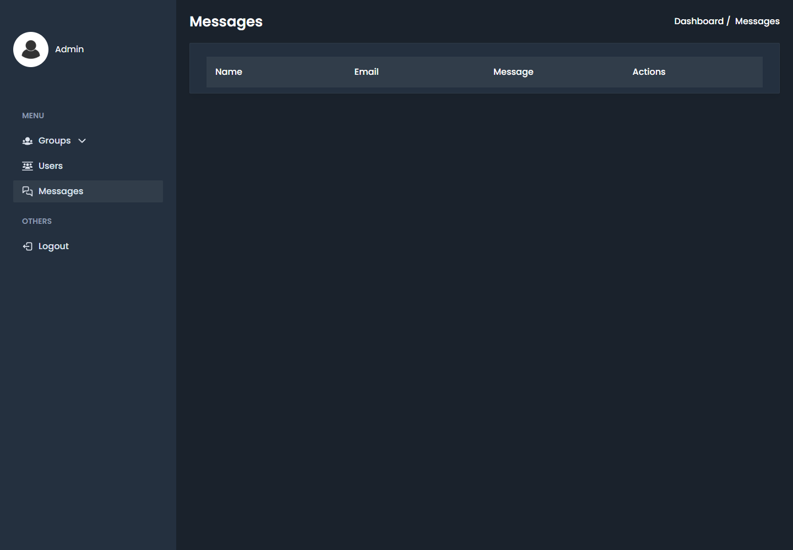
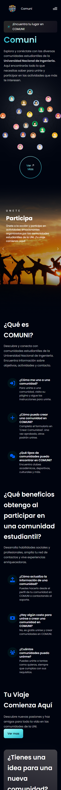
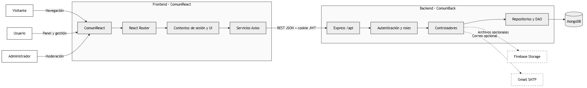
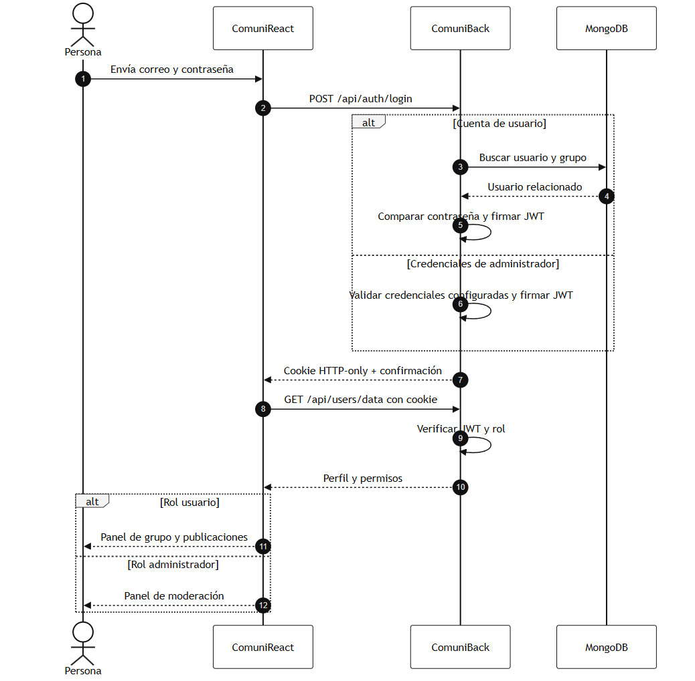

# Comuni — interfaz web

Frontend de **Comuni**, una plataforma para descubrir comunidades estudiantiles y ofrecer a sus responsables un espacio para gestionar información y publicaciones. También incluye un panel administrativo para moderar grupos, usuarios y mensajes.

> Este repositorio es la mitad cliente del proyecto. La API se encuentra en **[ComuniBack](https://github.com/AnthonyErazo/ComuniBack)**. Ambos repositorios forman una sola aplicación y deben ejecutarse juntos.

## Capturas

### Inicio



### Registro



### Panel de usuario



### Gestión del grupo



### Perfil de la comunidad



### Administración



### Vista móvil



## Arquitectura



ComuniReact concentra la navegación, los contextos de sesión e interfaz, y los servicios Axios. Todas las operaciones persistentes se delegan a ComuniBack mediante JSON y una cookie JWT HTTP-only.

## Flujo de autenticación y roles



Después de iniciar sesión, el cliente consulta `/api/users/data`. El rol recibido determina si se muestran las herramientas de gestión de una comunidad o las opciones administrativas.

## Funcionalidades

### Área pública

- Presentación y preguntas frecuentes.
- Exploración de comunidades y sus publicaciones.
- Formulario de contacto.
- Registro e inicio de sesión.

### Usuario autenticado

- Panel de resumen.
- Edición de información y redes del grupo.
- Carga de logotipo y portada.
- Creación y eliminación de publicaciones.
- Actualización de correo y contraseña.

### Administrador

- Consulta y eliminación de usuarios.
- Moderación de grupos y publicaciones.
- Consulta, respuesta y eliminación de mensajes.

## Tecnologías

- React 18 y React Router
- Vite
- Tailwind CSS y Styled Components
- Axios
- Headless UI, React Icons, GSAP y Swiper

## Requisitos

- Node.js 18 o superior
- npm
- [ComuniBack](https://github.com/AnthonyErazo/ComuniBack) ejecutándose

## Instalación

```bash
git clone https://github.com/AnthonyErazo/ComuniReact.git
cd ComuniReact
npm ci
```

Crea el archivo de entorno:

```powershell
Copy-Item .env.example .env
```

En Linux o macOS:

```bash
cp .env.example .env
```

El valor local recomendado es:

```env
VITE_API_BASE_URL=http://localhost:8080/api
```

Inicia el cliente:

```bash
npm run dev
```

Vite mostrará la URL disponible, normalmente `http://localhost:5173`.

## Rutas principales

| Ruta | Acceso | Contenido |
| --- | --- | --- |
| `/` | Público | Página de presentación y contacto. |
| `/groups` | Público | Directorio de comunidades. |
| `/groups/:gid` | Público | Información y publicaciones de una comunidad. |
| `/register` | Público | Creación de cuenta. |
| `/login` | Público | Inicio de sesión. |
| `/dashboard/inicio` | Usuario | Resumen del panel. |
| `/dashboard/myGroup` | Usuario | Gestión del grupo. |
| `/dashboard/myNotices` | Usuario | Gestión de publicaciones. |
| `/dashboard/profile` | Usuario | Perfil y credenciales. |
| `/dashboard/groups/allGroups` | Administrador | Moderación de grupos. |
| `/dashboard/groups/allNotices` | Administrador | Moderación de publicaciones. |
| `/dashboard/users` | Administrador | Gestión de usuarios. |
| `/dashboard/messages` | Administrador | Gestión de mensajes. |

Las rutas privadas se protegen en el cliente, mientras que ComuniBack vuelve a comprobar la sesión y el rol en cada endpoint restringido.

## Compilación

```bash
npm run build
```

Los archivos de producción se generan en `dist/`. La variable `VITE_API_BASE_URL` debe apuntar a la API que corresponda al entorno de despliegue.

## Ejecutar el proyecto completo

1. Inicia MongoDB.
2. Configura y ejecuta [ComuniBack](https://github.com/AnthonyErazo/ComuniBack) en `http://localhost:8080`.
3. Configura `VITE_API_BASE_URL=http://localhost:8080/api`.
4. Ejecuta `npm run dev` en este repositorio.
5. Registra un usuario para acceder al panel. El acceso administrativo usa las credenciales definidas en el `.env` del backend.

La carga de imágenes necesita Firebase y las funciones de correo necesitan Gmail configurados en ComuniBack; el resto del flujo puede utilizarse con MongoDB y las variables básicas.

---

Última actualización del código original: **9 de junio de 2024**. Documentación revisada: **21 de julio de 2026**.
